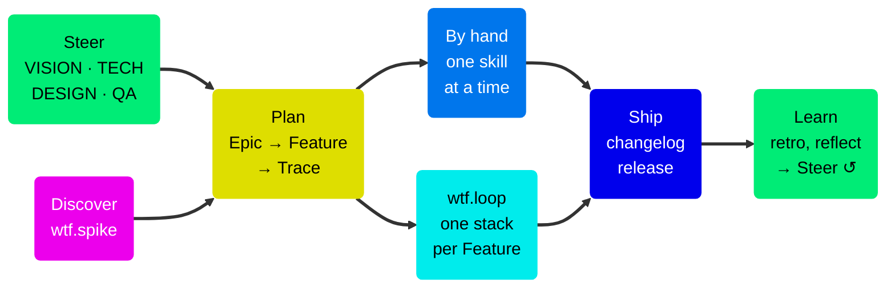

# WTF — Workflow Trace Framework

Agentic support for the full product development lifecycle, from user insight to verified production code. Agents do the structural work. Humans make every decision that matters.

WTF is a set of skills for AI coding assistants. The skills cover research, vision, planning, design, implementation, verification, release, and retrospective. They keep all work in your repo and in GitHub Issues. You do not maintain a second system.

Each skill stops at a judgment call and asks you. It does not guess. The GitHub issue holds the design, the implementation notes, and the verification verdict together. The issue is the single source of truth.

## Quick start

Install the skills from your project root:

```bash
npx skills add https://github.com/xiduzo/wtf
```

Open your AI assistant. Then run the setup skill:

```
/wtf.setup
```

To update the skills, run `npx skills update`.

You need an AI assistant that supports skills and the [GitHub CLI (`gh`)](https://cli.github.com), authenticated with the `repo` scope. [Getting started](https://github.com/xiduzo/wtf/wiki/Getting-Started) lists what `wtf.setup` installs.

## How it works



Write an Epic and split it into Features. Then split each Feature into Traces. A Trace claims a subset of the Gherkin scenarios of one story. It implements them through every layer in one pass. Run the Traces by hand, one skill at a time, or let `wtf.loop` run all of them. Each Feature ships as one linear stack of Trace PRs.

The shortest path:

```
wtf.write-epic              → draft the strategic initiative
wtf.epic-to-features        → split it into user-facing capabilities
wtf.feature-to-traces       → plan and create the Trace sequence per Feature
wtf.loop                    → implement → verify → PR → re-aim, autonomously
```

## Documentation

The [wiki](https://github.com/xiduzo/wtf/wiki/Home) has the full documentation:

- [Getting started](https://github.com/xiduzo/wtf/wiki/Getting-Started) — prerequisites and what `wtf.setup` installs
- [Configuration](https://github.com/xiduzo/wtf/wiki/Configuration) — the four settings in `.wtf/config.json`
- [The Trace model](https://github.com/xiduzo/wtf/wiki/The-Trace-Model) — Trace, Skeleton, Spine, and Scenario Claim
- [Delivery and stacks](https://github.com/xiduzo/wtf/wiki/Delivery-and-Stacks) — how Trace PRs stack and merge into `main`
- [Planning](https://github.com/xiduzo/wtf/wiki/Planning), [Running Traces](https://github.com/xiduzo/wtf/wiki/Running-Traces), and [Autonomous execution](https://github.com/xiduzo/wtf/wiki/Autonomous-Execution)
- [Skill reference](https://github.com/xiduzo/wtf/wiki/Skill-Reference) — every skill with its trigger

The source of the wiki pages is [`docs/wiki/`](docs/wiki/). Edit the pages there. A workflow copies them to the wiki on each push to `main`.

## When not to use WTF

- One-off scripts and throwaway projects. The structure costs more than it saves.
- Fully autonomous execution with no human gates. WTF stops for human decisions on purpose.
