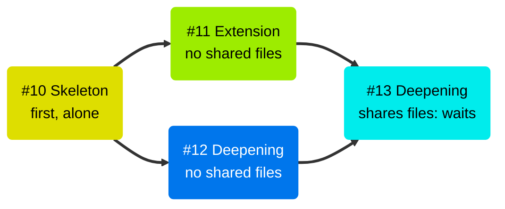
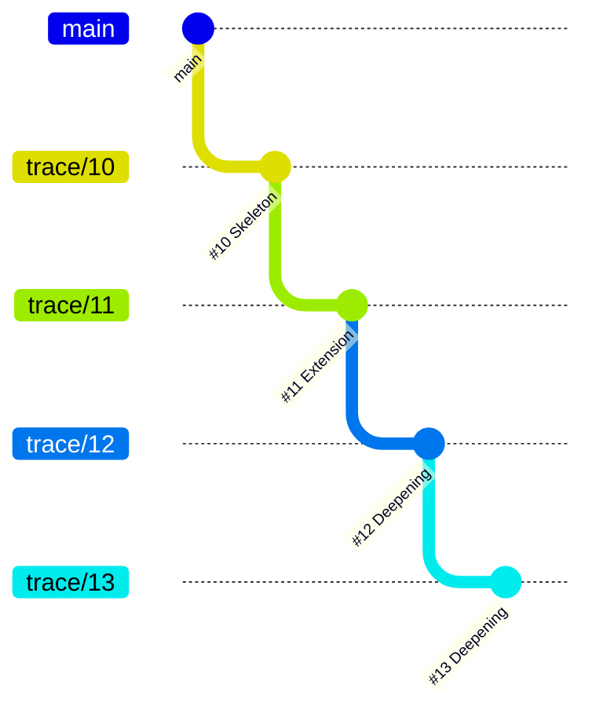

# Autonomous execution

| Skill | Trigger | Purpose |
| --- | --- | --- |
| `wtf.loop` | "go", "start building", "build it all" | Chain implement → verify → PR → re-aim for every Trace, Skeleton first |

`wtf.loop` needs a fully specified Epic, Feature, and Trace tree. It runs every Trace the way the [manual skills](Running-Traces.md) do, without the "what's next?" prompts.

## The five steps

1. **Graph** — walk Epic → Features → Traces and build the dependency graph.
2. **Check** — run the pre-flight checks: spec completeness, contradictions, codebase mismatches, and circular dependencies.
3. **Review** — the loop proposes an execution plan. You approve it.
4. **Execute** — run the Traces of each Feature. Features that share no files run in parallel.
5. **Deliver** — each Feature ends as one linear stack of Trace PRs. In `staged` delivery the loop then opens the feature PR to `main`. In `trunk` delivery the last Trace PR closes the Feature.

## Inside one Feature

The Skeleton runs first and alone. When its PR is open and green, the file-conflict graph puts the remaining Traces into sub-phases:

- Traces that share no files build at the same time, each in its own worktree.
- A Trace that shares files with an earlier Trace waits for the next sub-phase.
- A Trace never waits for a merge. It branches off the top of the stack.

## Each Trace

1. **Implement** — `wtf.implement-trace` drives TDD over the Scenario Claim.
2. **Verify** — `wtf.verify-trace` runs the claimed scenarios.
3. **Join the stack** — rebase onto the top of the stack when needed, run the tests, and push.
4. **Open the PR** — target the top of the stack and link the PR into the native GitHub stack.
5. **Merge** — wait for CI. Without required reviews, the loop merges bottom-up when CI is green. With required reviews, the PR waits for a reviewer and the loop continues.
6. **Re-aim** — headless `wtf.refine` updates the Feature's Trace Plan.

## The stack

Traces join the stack of their Feature in a fixed order: sub-phase first, then Trace Plan order. #11 and #12 build at the same time. #11 joins first, then #12 rebases onto #11 and joins on top. The Feature ends the run as one linear stack:

Each PR targets the branch below it. The bottom PR targets the feature branch in `staged` delivery, or `main` in `trunk`. [Delivery and stacks](Delivery-and-Stacks.md) shows how the stack merges back into `main`.

## Pauses and resume

The loop pauses only for a human decision: a contradiction, an ambiguity, or a change to a Trace Plan's scenario set. It collects the open questions and asks them in one batch.

The loop resumes a previous run. It skips Traces labeled `implemented` or `verified`.
