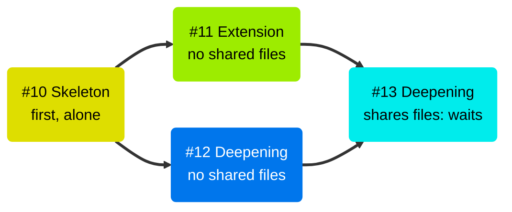
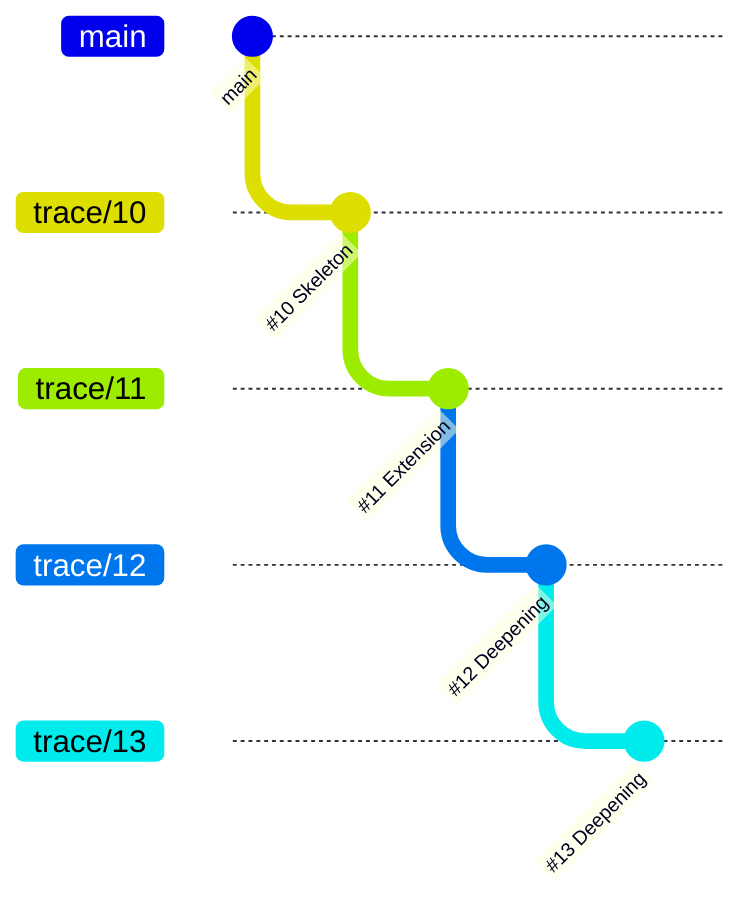

# Autonomous execution

| Skill | Trigger | Purpose |
| --- | --- | --- |
| `wtf.loop` | "go", "start building", "build it all" | Chain implement → verify → PR → re-aim for every Trace, Skeleton first |

`wtf.loop` needs a fully specified tree of an Epic, its Features, and their Traces. It runs each Trace the same way as the [manual skills](Running-Traces.md), but without the "what's next?" prompts.

## The five steps

1. **Graph** — the loop reads the Epic, its Features, and their Traces. It builds the dependency graph.
2. **Check** — the loop runs the pre-flight checks: spec completeness, contradictions, codebase mismatches, and circular dependencies.
3. **Review** — the loop proposes an execution plan. You approve it.
4. **Execute** — the loop runs the Traces of each Feature. Features that share no files run in parallel.
5. **Deliver** — each Feature ends as one linear stack of Trace PRs. In `staged` delivery, the loop then opens the feature PR to `main`. In `trunk` delivery, the last Trace PR closes the Feature.

## Inside one Feature

The Skeleton runs first and alone. When its PR is open and green, the file-conflict graph puts the other Traces into sub-phases:

- Traces that share no files build at the same time, each in its own worktree.
- A Trace that shares files with an earlier Trace waits for the next sub-phase.
- A Trace never waits for a merge. It starts its branch from the top of the stack.

## Each Trace

1. **Implement** — `wtf.implement-trace` drives TDD over the Scenario Claim.
2. **Verify** — `wtf.verify-trace` runs the claimed scenarios.
3. **Join the stack** — when necessary, the loop rebases the branch onto the top of the stack. Then it runs the tests and pushes the branch.
4. **Open the PR** — the PR targets the top of the stack. The loop links it into the native GitHub stack.
5. **Merge** — the loop waits for CI. If the repo has no required reviews, the loop merges bottom-up when CI is green. If the repo has required reviews, the PR waits for a reviewer, and the loop continues.
6. **Re-aim** — `wtf.refine` runs without prompts and updates the Trace Plan of the Feature.

## The stack

Traces join the stack of their Feature in a fixed order: sub-phase first, then Trace Plan order. In the example, #11 and #12 build at the same time. #11 joins first. Then #12 rebases onto #11 and joins on top of it. At the end of the run, the Feature is one linear stack:

Each PR targets the branch below it. The bottom PR targets the feature branch in `staged` delivery, or `main` in `trunk`. [Delivery and stacks](Delivery-and-Stacks.md) shows how the stack merges into `main`.

## Pauses and resume

The loop stops only for a human decision: a contradiction, an ambiguity, or a change to the set of scenarios in a Trace Plan. It collects the open questions and asks them all at one time.

To continue a stopped run, start the loop again. It skips each Trace with the `implemented` or `verified` label.
