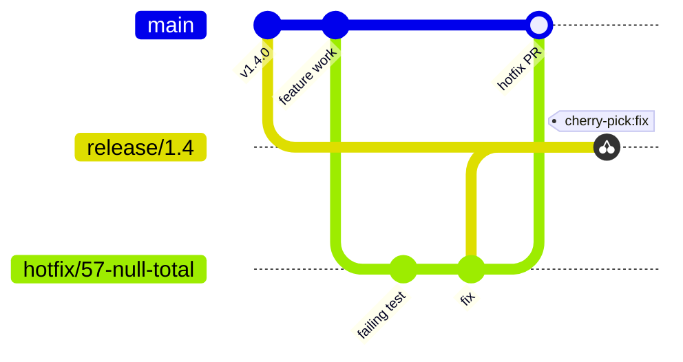

# Bugs and hotfixes

| Skill | Trigger | Purpose |
| --- | --- | --- |
| `wtf.report-bug` | "report a bug" | File a structured Bug issue linked to the originating Trace |
| `wtf.hotfix` | "production is down", "emergency fix for #X" | Cut a hotfix branch from `main` and fix. Bypasses the planning hierarchy. |

## Report a bug

`wtf.report-bug` records the failing Gherkin scenarios as reproducible evidence and links the originating Trace and Feature.

## Hotfix

`wtf.hotfix` serves production incidents where the full flow is too slow. It skips the planning spine:

1. Cut a `hotfix/<bug>-<slug>` branch from `main`.
2. Write the failing test first, then the fix.
3. Open a PR back to `main`.
4. Optionally, after the merge, cherry-pick the fix onto a release branch.

A scope gate redirects a large fix to the normal workflow.
