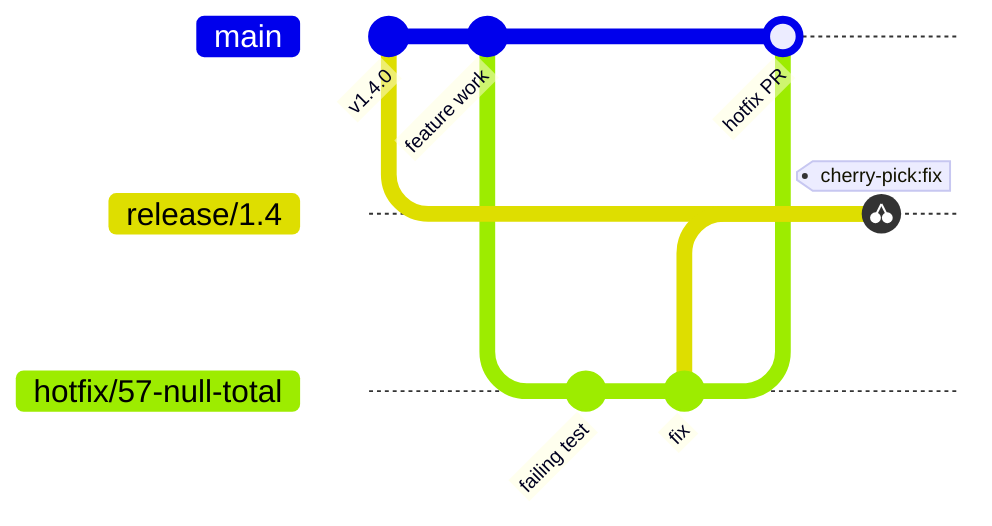

# Bugs and hotfixes

| Skill | Trigger | Purpose |
| --- | --- | --- |
| `wtf.report-bug` | "report a bug" | File a structured Bug issue linked to the originating Trace |
| `wtf.hotfix` | "production is down", "emergency fix for #X" | Create a hotfix branch from `main` and fix the problem. Skips the planning hierarchy. |

## Report a bug

`wtf.report-bug` records the failing Gherkin scenarios as evidence that you can reproduce. It links the Bug to the originating Trace and Feature.

## Hotfix

Use `wtf.hotfix` for a production incident when the full workflow is too slow. The skill skips the planning hierarchy:

1. Create a `hotfix/<bug>-<slug>` branch from `main`.
2. Write a test that fails.
3. Write the fix.
4. Open a PR to `main`.
5. Optional: after the merge, cherry-pick the fix onto a release branch.

If the fix is large, a scope gate sends it to the normal workflow.
