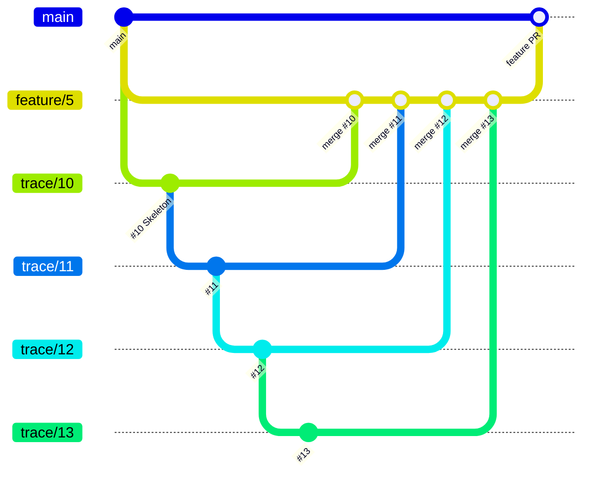
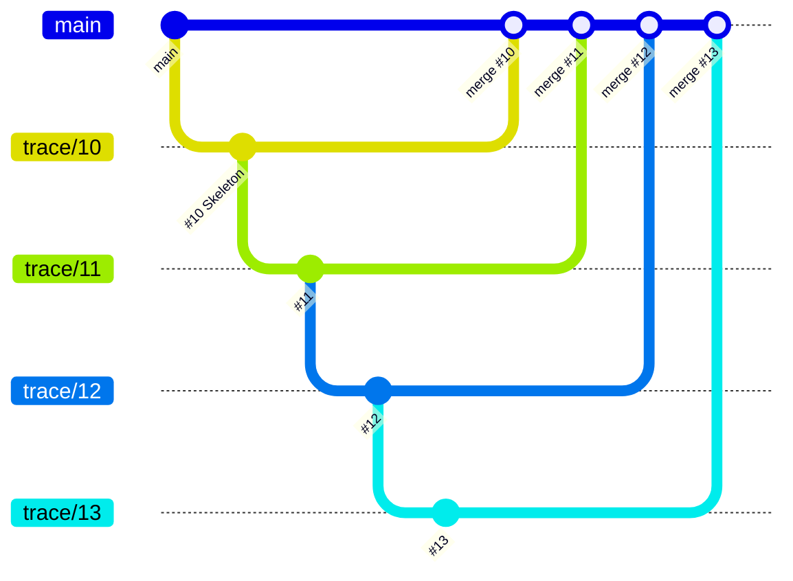

# Delivery and stacks

Each Feature delivers through one linear stack of Trace PRs. The `delivery` key in [Configuration](Configuration.md) decides where the stack merges.

## `staged` (default)

Trace PRs merge into the feature branch. The feature PR then merges into `main` and closes the Feature.

## `trunk`

Each Trace PR merges into `main`. The last one closes the Feature.

## How a Trace joins the stack

The **stack tip** is the head branch of the highest open Trace PR of the Feature. With no open Trace PR, the tip is the feature branch (`staged`) or `main` (`trunk`).

- A Trace branches off the stack tip. It never waits for a merge.
- Before its PR opens, the Trace rebases onto the current tip when needed, runs the tests, and pushes.
- The PR targets the tip. `wtf.create-pr` then links it into the native GitHub stack.
- A Trace is ready to start when every Trace it builds on has joined the stack or merged.

## Merge rules

- Merge bottom-up, with a merge commit. Never squash a Trace PR.
- Each merge deletes the head branch. GitHub then retargets the next PR in the stack. `wtf.setup` turns on **Automatically delete head branches** for this.
- Without required reviews, `wtf.loop` merges each PR when CI is green. With required reviews, the open PRs wait for a reviewer as one stack.
- To merge several layers at once, run `gh stack merge <pr-number>` and pick the merge-commit method.

## Native stacks with `gh-stack`

`wtf.setup` installs [`github/gh-stack`](https://github.com/github/gh-stack). WTF links the existing Trace PRs into a stack with `gh stack link <bottom-pr> ... <top-pr>`. GitHub then shows the stack map on every PR, and each PR shows only its own diff.

Without the extension, the PRs still stack by base branch. `wtf.create-pr` then adds a "stacked PR" note to the PR body.

A native stack locks the base branches:

- `gh pr edit --base` on a stacked PR fails with `part of a stack`. Run `gh stack unstack <stack-number>`, change the base, then link the PRs again.
- `gh stack view` shows local tracking only. Check the stack map on the PR page instead.
