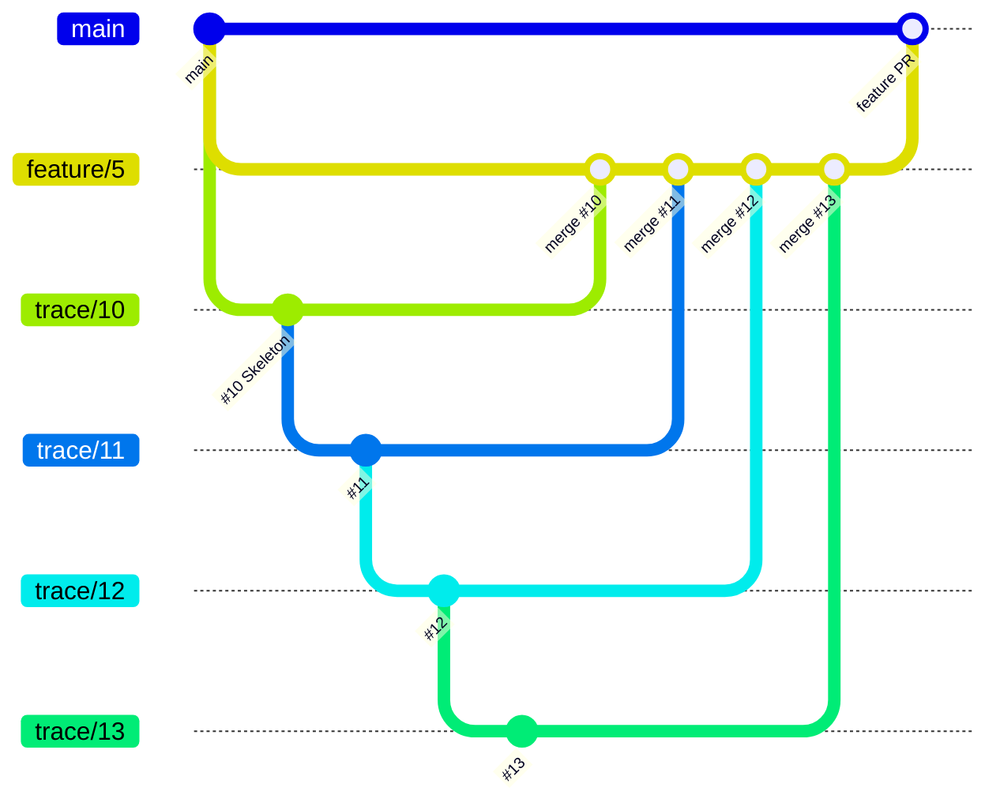
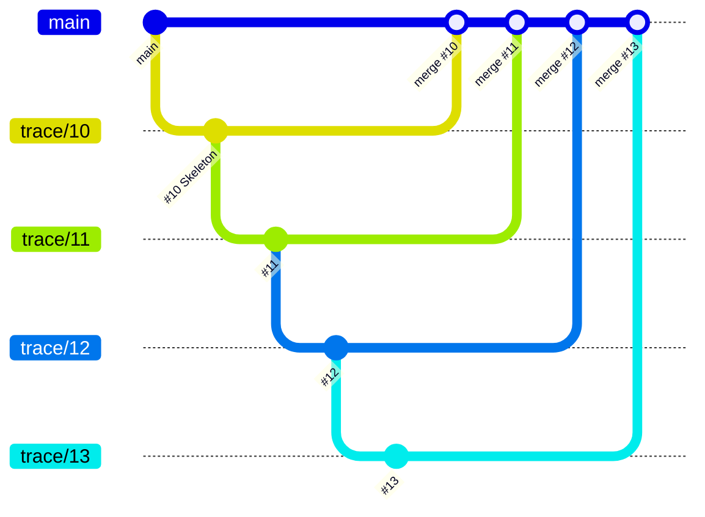

# Delivery and stacks

Each Feature delivers through one linear stack of Trace PRs. The `delivery` key in [Configuration](Configuration.md) sets where the stack merges.

## `staged` (default)

Trace PRs merge into the feature branch. The feature PR then merges into `main` and closes the Feature.

## `trunk`

Each Trace PR merges into `main`. The last Trace PR closes the Feature.

## How a Trace joins the stack

The **stack tip** is the head branch of the highest open Trace PR of the Feature. If the Feature has no open Trace PR, the tip is the feature branch (`staged`) or `main` (`trunk`).

- A Trace starts its branch from the stack tip. It never waits for a merge.
- Before WTF opens the PR, it rebases the branch onto the current tip when necessary. Then it runs the tests and pushes the branch.
- The PR targets the tip. Then `wtf.create-pr` links the PR into the native GitHub stack.
- A Trace is ready to start when each Trace that it builds on is in the stack or merged.

## Merge rules

- Merge bottom-up, with a merge commit. Never squash a Trace PR.
- Each merge deletes the head branch. Then GitHub retargets the next PR in the stack. For this, `wtf.setup` enables **Automatically delete head branches**.
- If the repo has no required reviews, `wtf.loop` merges each PR when CI is green. If the repo has required reviews, the open PRs wait for a reviewer as one stack.
- To merge more than one layer at a time, run `gh stack merge <pr-number>`. Select the merge-commit method.

## Native stacks with `gh-stack`

`wtf.setup` installs [`github/gh-stack`](https://github.com/github/gh-stack). WTF links the open Trace PRs into a stack with `gh stack link <bottom-pr> ... <top-pr>`. GitHub then shows the stack map on each PR, and each PR shows only its own diff.

If the extension is not installed, the PRs stack by base branch only. Then `wtf.create-pr` adds a "stacked PR" note to the PR body.

A native stack locks the base branches:

- `gh pr edit --base` on a stacked PR fails with the error `part of a stack`. To change the base, run `gh stack unstack <stack-number>` first. Then change the base, and link the PRs with `gh stack link`.
- `gh stack view` shows only the local tracking. To see the stack on GitHub, look at the stack map on a PR page.
