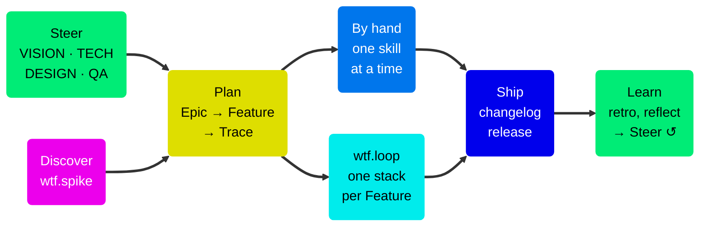

# WTF — Workflow Trace Framework

Agentic support for the full product development lifecycle, from user insight to verified production code. Agents do the structural work. Humans make every decision that matters.

WTF is a set of skills for AI coding assistants. The skills cover research, vision, planning, design, implementation, verification, release, and retrospective. They keep all work in your repo and in GitHub Issues. You do not maintain a second system.

Each skill stops at a judgment call and asks you. It does not guess. The GitHub issue holds the design, the implementation notes, and the verification verdict together. The issue is the single source of truth.

## The lifecycle



- **Steer** — the VISION, TECH, DESIGN, and QA docs guide each issue, design, and review. See [Steering docs](Steering-Docs.md).
- **Discover** — spikes and user insights give input to the plan. See [Planning](Planning.md).
- **Plan** — split the work into Epic → Feature → Trace. The Feature holds the user stories and their Gherkin scenarios. Each Trace claims a subset of those scenarios. See [The Trace model](The-Trace-Model.md).
- **Build and verify** — run each Trace by hand, one skill at a time, or run all Traces with `wtf.loop`. See [Running Traces](Running-Traces.md) and [Autonomous execution](Autonomous-Execution.md).
- **Ship** — WTF writes each PR from the full spec hierarchy and the changelog from the Gherkin. See [Delivery and stacks](Delivery-and-Stacks.md) and [Release and closure](Release-and-Closure.md).
- **Learn** — retros and reflections add the learnings to the steering docs.

## The shortest path

```
wtf.write-epic              → draft the strategic initiative
wtf.epic-to-features        → split it into user-facing capabilities
wtf.feature-to-traces       → plan and create the Trace sequence per Feature
wtf.loop                    → implement → verify → PR → re-aim, autonomously
```

Each step writes its output to the GitHub issue. To start, read [Getting started](Getting-Started.md).

## When not to use WTF

- One-off scripts and throwaway projects. The structure costs more than it saves.
- Fully autonomous execution with no human gates. WTF stops for human decisions on purpose.
