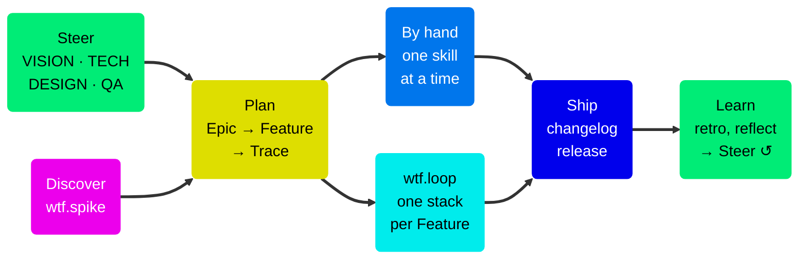

# WTF — Workflow Trace Framework

Agentic support for the full product development lifecycle, from user insight to verified production code. Agents do the structural work. Humans make every decision that matters.

WTF is a set of skills for AI coding assistants. The skills cover research, vision, planning, design, implementation, verification, release, and retrospective. They live in the repo and the GitHub Issues you already use. There is no second system to maintain.

Each skill pauses at a judgment call instead of guessing. The GitHub issue holds the design, the implementation notes, and the verification verdict side by side. It stays the single source of truth.

## The lifecycle



- **Steer** — living VISION, TECH, DESIGN, and QA docs inform every write. See [Steering docs](Steering-Docs.md).
- **Discover** — spikes and user insights feed planning. See [Planning](Planning.md).
- **Plan** — Epic → Feature → Trace. User stories and their Gherkin scenarios live on the Feature. Each Trace claims a subset of those scenarios. See [The Trace model](The-Trace-Model.md).
- **Build and verify** — by hand, one skill at a time, or with `wtf.loop`. See [Running Traces](Running-Traces.md) and [Autonomous execution](Autonomous-Execution.md).
- **Ship** — PRs written from the full spec hierarchy, changelogs written from the Gherkin. See [Delivery and stacks](Delivery-and-Stacks.md) and [Release and closure](Release-and-Closure.md).
- **Learn** — retros and reflections write learnings back into the steering docs.

## The shortest path

```
wtf.write-epic              → draft the strategic initiative
wtf.epic-to-features        → split it into user-facing capabilities
wtf.feature-to-traces       → plan and create the Trace sequence per Feature
wtf.loop                    → implement → verify → PR → re-aim, autonomously
```

Every step writes back to the GitHub issue. Start with [Getting started](Getting-Started.md).

## When not to use WTF

- One-off scripts or throwaway projects, where the structure costs more than it saves.
- Fully autonomous execution with no human gates. WTF keeps humans in the loop on purpose.
