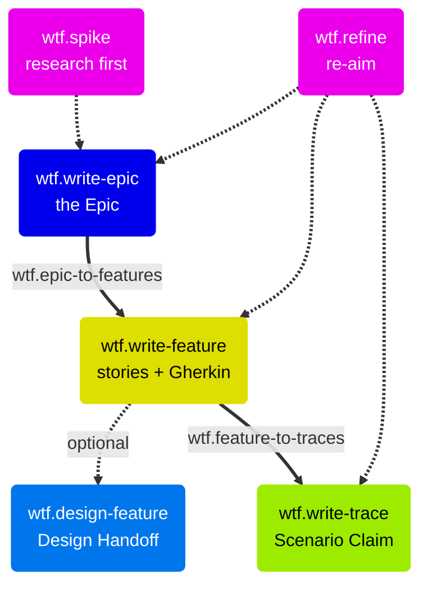

# Planning

Planning turns an initiative into Epic, Feature, and Trace issues on GitHub. A spike can come first. When the requirements change, `wtf.refine` updates the tree.

## Pre-planning

| Skill | Trigger | Purpose |
| --- | --- | --- |
| `wtf.spike` | "run a spike on X" | A time-boxed technical investigation before you select an approach |

`wtf.spike` defines the question, time-boxes the investigation, and researches the codebase and docs. It derives two or three approaches with their trade-offs. Then it writes a recommendation to `docs/spikes/`. The findings are input for `wtf.write-epic` or `wtf.write-trace`.

## Epic → Feature → Trace

| Skill | Trigger | Purpose |
| --- | --- | --- |
| `wtf.write-epic` | "create an epic" | Define a strategic initiative |
| `wtf.write-feature` | "create a feature" | Describe one user-facing capability with its stories and Gherkin |
| `wtf.write-trace` | "create a trace" | Claim the scenarios of one story as one implementation pass |

Each skill reads the parent issue and guides you through a structured workflow. It ends with a new GitHub issue, linked to its parent. The Feature holds the user stories and their canonical Gherkin scenarios. A Trace claims a subset of those scenarios and never re-derives them. See [The Trace model](The-Trace-Model.md).

## Batch decomposition

| Skill | Trigger | Purpose |
| --- | --- | --- |
| `wtf.epic-to-features` | "break down this epic" | Propose and create all Features for an Epic |
| `wtf.feature-to-traces` | "plan all traces for feature #12" | Validate the Trace Plan and create all Traces for a Feature |

The two skills show the full plan first. `wtf.feature-to-traces` validates the Trace Plan of the Feature. When the Feature has no Trace Plan, the skill derives one. Then it creates the Trace issues in Spine order. It links each Trace to the Traces that it builds on.

In `guided` mode, you confirm each item, with pause, skip, and add controls. In `flow` mode, the skill shows one consolidated review and then creates the batch. Thus `flow` has two user gates: confirm the plan, and approve the tree.

## Feature design

| Skill | Trigger | Purpose |
| --- | --- | --- |
| `wtf.design-feature` | "design feature #12" | Map the full UX flow for a Feature and write the Design Handoff |

`wtf.design-feature` reads the user stories and Acceptance Criteria of the Feature. It derives each screen and state of the user journey. It collects or scaffolds Figma frames. Then it writes the result into the **Design Handoff** section of the Feature issue. This satisfies the Definition of Ready gate "Design handoff complete" before you create the Traces.

The **Design Artifacts** field of the Epic is different. It holds strategic input, such as vision prototypes and UX research. The Design Handoff of the Feature is the output that developers build against. `wtf.design-trace` uses the shared component map from this skill.

## Re-aim with `wtf.refine`

| Skill | Trigger | Purpose |
| --- | --- | --- |
| `wtf.refine` | "re-aim feature #12" | Update an Epic, Feature, or Trace from new insights. This is the only Re-aim mechanism. |

`wtf.refine` merges insights from the conversation, GitHub comments, and referenced docs. It validates only the affected sections again. Before it applies the update, it shows a diff for each section. It posts an audit-trail comment. It also copies each scenario edit to the Traces that claim that scenario. `wtf.loop` runs it without prompts as the Re-aim step after each verified Trace.
