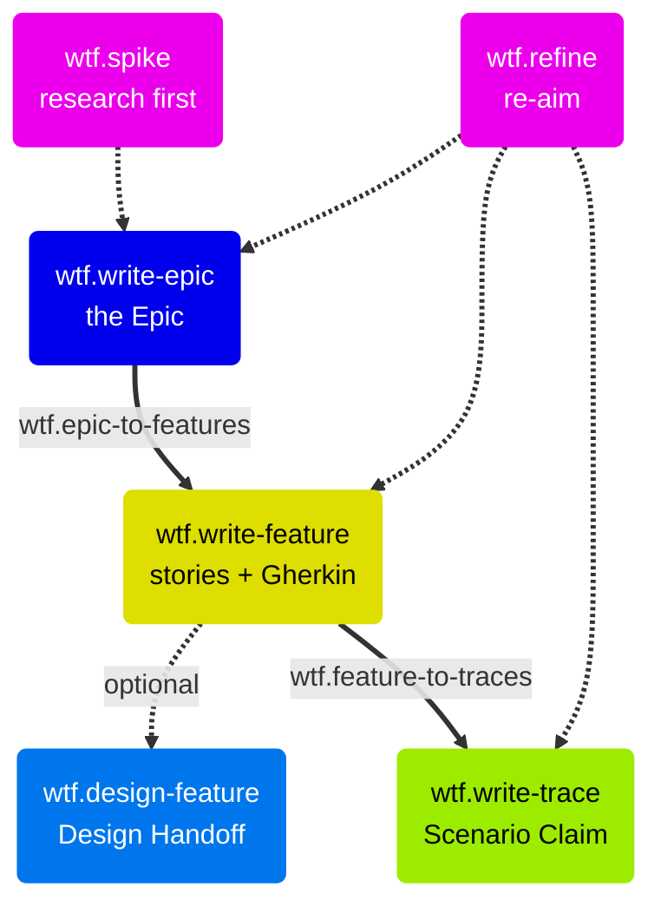

# Planning

Planning turns an initiative into Epic → Feature → Trace issues on GitHub. A spike can come first. `wtf.refine` keeps the tree aligned when requirements change.

## Pre-planning

| Skill | Trigger | Purpose |
| --- | --- | --- |
| `wtf.spike` | "run a spike on X" | Time-boxed technical investigation before you commit to an approach |

`wtf.spike` defines the question, time-boxes the investigation, and researches the codebase and docs. It derives two or three approaches with trade-offs and writes a recommendation to `docs/spikes/`. The findings feed `wtf.write-epic` or `wtf.write-trace`.

## Epic → Feature → Trace

| Skill | Trigger | Purpose |
| --- | --- | --- |
| `wtf.write-epic` | "create an epic" | Define a strategic initiative |
| `wtf.write-feature` | "create a feature" | Describe one user-facing capability with its stories and Gherkin |
| `wtf.write-trace` | "create a trace" | Claim one story's scenarios as one implementation pass |

Each skill reads the parent issue, guides you through a structured workflow, and ends with a created and linked GitHub issue. Features carry the user stories with their canonical Gherkin scenarios. Traces claim a subset of those scenarios and never re-derive them. See [The Trace model](The-Trace-Model.md).

## Batch decomposition

| Skill | Trigger | Purpose |
| --- | --- | --- |
| `wtf.epic-to-features` | "break down this epic" | Propose and create all Features for an Epic |
| `wtf.feature-to-traces` | "plan all traces for feature #12" | Validate the Trace Plan and create all Traces for a Feature |

Both skills propose the full plan first. `wtf.feature-to-traces` validates the Feature's Trace Plan, or derives one for an older Feature. It then creates the Trace issues in spine order with sequential dependency links. In `guided` mode you create each item one by one, with pause, skip, and add controls. In `flow` mode the skill shows one consolidated review and then creates the batch. That is two user gates in total: confirm the plan, approve the tree.

## Feature design

| Skill | Trigger | Purpose |
| --- | --- | --- |
| `wtf.design-feature` | "design feature #12" | Map the full UX flow for a Feature and write the Design Handoff |

`wtf.design-feature` reads the Feature's user stories and Acceptance Criteria and derives every screen and state in the journey. It collects or scaffolds Figma frames and writes the result into the **Design Handoff** section of the Feature issue. That satisfies the Definition of Ready gate "Design handoff complete" before you cut the Traces.

The Epic's **Design Artifacts** field is different. It holds upstream strategic inputs, such as vision prototypes and UX research. The Feature's Design Handoff is the execution-level output that developers build against. The shared component map from this skill flows into `wtf.design-trace`.

## Re-aim with `wtf.refine`

| Skill | Trigger | Purpose |
| --- | --- | --- |
| `wtf.refine` | "re-aim feature #12" | Update an existing Epic, Feature, or Trace from new insights. The single Re-aim mechanism. |

`wtf.refine` merges insights from the conversation, GitHub comments, and referenced docs. It re-validates only the affected sections and shows a section-by-section diff before it applies the update. It posts an audit-trail comment and cascades scenario edits to the Traces that claim them. `wtf.loop` runs it headless as the Re-aim step after each verified Trace.
