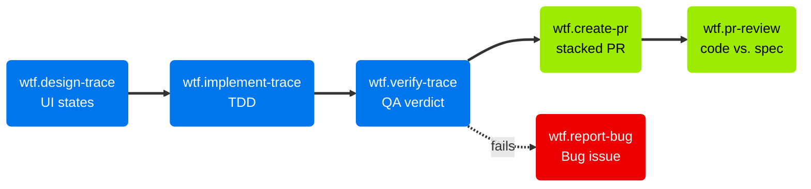

# Running Traces

When a Trace exists, each discipline works on it with its own skill. Each skill writes its output into the Trace issue. Then it offers to start the next step. To run all Traces without these manual steps, use [`wtf.loop`](Autonomous-Execution.md).

## Design, implement, verify

| Skill | Trigger | Purpose |
| --- | --- | --- |
| `wtf.design-trace` | "design trace #42" | The designer maps the claimed scenarios to Figma frames and component specs |
| `wtf.implement-trace` | "implement trace #42" | The developer drafts the technical approach and drives TDD over the Scenario Claim |
| `wtf.verify-trace` | "verify trace #42" | QA runs the claimed scenarios and records a pass or fail verdict |

When `wtf.design-feature` made a shared component map, `wtf.design-trace` uses it. The skill covers the UI states of the claimed scenarios of one Trace, not the full journey.

`wtf.implement-trace` runs the TDD cycle for each scenario in the Scenario Claim. A Skeleton Trace gets an explicit instruction: minimal, through every layer, and no extra scope. Lint and type checks run one time, after all scenarios pass. This keeps the skill fast on large codebases.

`wtf.verify-trace` runs exactly the claimed scenarios. It copies them from the Feature body into a temporary `.feature` file. When the project has a Gherkin runner, the runner executes that file. If not, the skill verifies each scenario itself. The skill does not commit the `.feature` file.

## Ship and review

| Skill | Trigger | Purpose |
| --- | --- | --- |
| `wtf.create-pr` | "create a PR" | Open a PR with a description derived from the Trace, Feature, and Epic |
| `wtf.pr-review` | "review PR #42" | Review the code of a PR against the linked Trace spec |

`wtf.create-pr` reads the full spec hierarchy and the branch diff. It writes a PR description that explains why the change exists. It also checks the verification status and offers to run `wtf.verify-trace` first.

The base branch follows the delivery mode: the feature branch in `staged`, and `main` in `trunk`. When the Feature has another open Trace PR, the new PR targets the top of the stack. Then the skill links the PR into the native GitHub stack with `gh-stack`. See [Delivery and stacks](Delivery-and-Stacks.md).

`wtf.pr-review` compares the diff with the claimed scenarios, Contracts, and Impacted Areas of the Trace. It checks spec adherence, contract compliance, test coverage, and code quality against `TECH.md`. Then it posts a GitHub PR review: approve, request changes, or comment.

The two verification skills are different. `wtf.verify-trace` acts as QA: it runs the software and checks the behavior. `wtf.pr-review` acts as a tech lead: it reads the code and checks it against the spec.

When a claimed scenario fails, `wtf.report-bug` files a Bug issue. See [Bugs and hotfixes](Bugs-and-Hotfixes.md).
