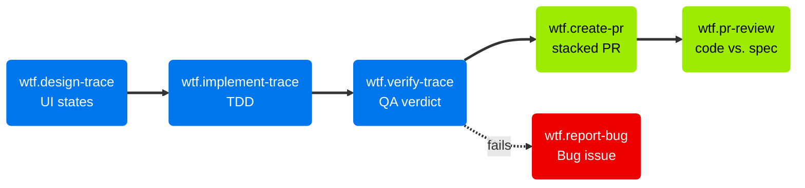

# Running Traces

Once a Trace exists, each discipline can work on it independently, one skill at a time. Each skill writes its output into the Trace issue and offers to chain to the next step. To run every Trace without the manual steps, use [`wtf.loop`](Autonomous-Execution.md).

## Design, implement, verify

| Skill | Trigger | Purpose |
| --- | --- | --- |
| `wtf.design-trace` | "design trace #42" | Designer maps the claimed scenarios to Figma frames and component specs |
| `wtf.implement-trace` | "implement trace #42" | Developer drafts the technical approach and drives TDD over the Scenario Claim |
| `wtf.verify-trace` | "verify trace #42" | QA runs the claimed scenarios and records a pass or fail verdict |

`wtf.design-trace` inherits the shared component map from `wtf.design-feature` when it exists. It covers the UI states for one Trace's claimed scenarios, not the full journey.

`wtf.implement-trace` runs the TDD cycle scenario by scenario over the Scenario Claim. A Skeleton Trace gets an explicit directive: minimal, through every layer, no gold-plating. Lint and type checks run once after all scenarios pass, which keeps large codebases fast.

`wtf.verify-trace` runs exactly the claimed scenarios through an **ephemeral projection**. It scrapes them from the Feature body into a temporary `.feature` file. When a Gherkin runner exists, it executes that file. Otherwise it verifies the scenarios interpretively. The skill commits no `.feature` file.

## Ship and review

| Skill | Trigger | Purpose |
| --- | --- | --- |
| `wtf.create-pr` | "create a PR" | Open a PR with a description derived from the Trace, Feature, and Epic |
| `wtf.pr-review` | "review PR #42" | Review a PR's code against the linked Trace spec |

`wtf.create-pr` reads the full spec hierarchy and the branch diff. It writes a PR description that explains why the change exists. The base branch follows the delivery mode: the feature branch in `staged`, `main` in `trunk`. When another Trace PR of the Feature is open, a Trace targets the top of the Feature's stack instead. The skill links a stacked Trace PR into its native GitHub stack with `gh-stack`. It checks the verification status and offers to run `wtf.verify-trace` first. See [Delivery and stacks](Delivery-and-Stacks.md).

`wtf.pr-review` reads the diff against the Trace's claimed scenarios, Contracts, and Impacted Areas. It checks spec adherence, contract compliance, test coverage, and code quality against `TECH.md`. It posts a GitHub PR review: approve, request changes, or comment.

The two verification skills differ. `wtf.verify-trace` is QA: it runs the software and checks the behavior. `wtf.pr-review` is a tech lead: it reads the code and checks it against the spec.

When a claimed scenario fails, `wtf.report-bug` files a Bug issue. See [Bugs and hotfixes](Bugs-and-Hotfixes.md).
